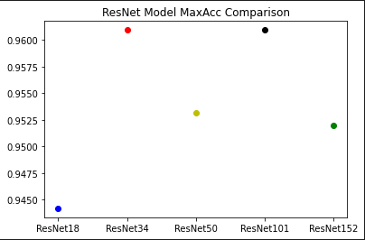
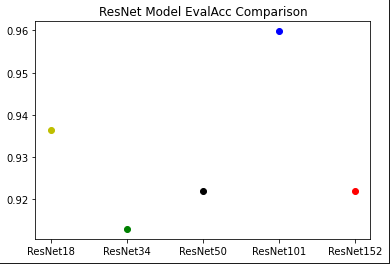

# ResNet Comparison for Garbage Image Classification with PyTorch

---

## Models

All ResNet models have been trained on a local GPU (MSI GAMING X TRIO GeForce RTX 3070 Ti) then saved as individual pickle files. Each model contains a few custom attributes as follows; name,history,maxAcc,evalAcc. These attributes primarily contain summary data from the last training for each respective model. Running this notebook will download the training data and the trained models for exploration.

## Goal

In this notebook we will implement different ResNet’s with the goal of comparing the models to find the 'best' for our classifier.

We are seeking to understand which ResNet configurations are most effective for classifying images of garbage. This type of modeling could be used for automated garbage aggregation systems.

## Model Comparison

 

## Conclusion

Comparing ResNet models with an adam optimizer 8 epochs and a learning rate of 5.5e-5 for classification of garbage types yields a max model accuracy of 96% for the ResNet101 pretrained model. We should consider retraining the ResNet101 model with more epochs to locate where the accuracy fall off begins.

For reference, a good list of models and accuracies sit in pytorch’s docs: https://pytorch.org/vision/main/models.html